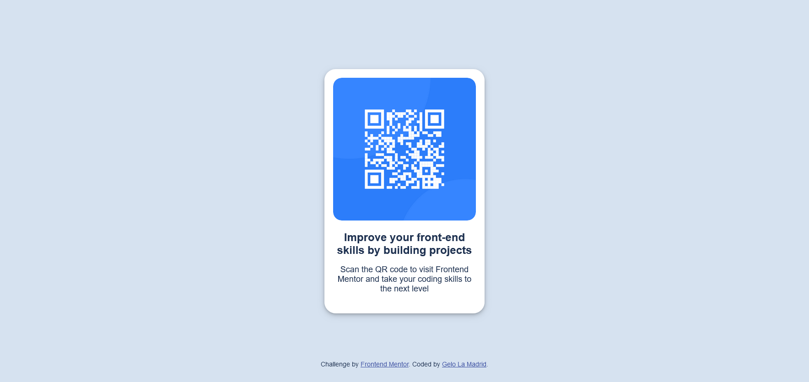

# Frontend Mentor - QR code component solution

This is a solution to the [QR code component challenge on Frontend Mentor](https://www.frontendmentor.io/challenges/qr-code-component-iux_sIO_H). Frontend Mentor challenges help you improve your coding skills by building realistic projects. 

## Table of contents

- [Overview](#overview)
  - [Screenshot](#screenshot)
  - [Links](#links)
- [My process](#my-process)
  - [Built with](#built-with)
  - [What I learned](#what-i-learned)
  - [Useful resources](#useful-resources)
- [Author](#author)


## Overview

### Screenshot



### Links

- Solution URL: [github.com/gelolmdrd/QR-Code-Component](https://github.com/gelolmdrd/QR-Code-Component)
- Live Site URL: [gelolmdrd.github.io/QR-Code-Component/] (https://gelolmdrd.github.io/QR-Code-Component/)

## My process

### Built with

- Semantic HTML5 markup
- CSS custom properties
- Flexbox


### What I learned

In this challenge, the first thing I did in doing this project is to design the web page as close to the design provided. I also modified to html file to divide the sections of the web page using <div>, and also to make it easier to style it in css.

In addition I learned how to align to center objects of a webpage using flexboxes. I also learned how to add animations to my elements for a more interactive design. 

Some of the code I'm proud of:

```css
@keyframes fadeInAnimation {
    from {
        transform: translate3d(0,-20px,0);
        opacity: 0%;
    }

    to {
        transform: translate3d(0,0,0);
        opacity: 100%;
    }
}
```
This is the code I used to have a fade in animation for the QR Code Component.

```css
.img-holder {
    border-radius: 15px;
    object-fit: contain;
    overflow: hidden;
}

.img-holder img{
    border-radius: 15px;
    transition: transform 0.9s ease;
}

.img-holder:hover img{
    transform: scale(1.4);
}
```
This is the code I used to have the zoom in effect to the QR code when hovered by the user.


### Useful resources

- [Freecodecamp.org](https://www.freecodecamp.org/news/how-to-center-anything-with-css-align-a-div-text-and-more/) - This helped me in understanding how flexboxes work in CSS. It allowed me to align the QR Code Component to the center the page.
- [W3bits](https://w3bits.com/css-image-hover-zoom/) - This is source helped me in learning how to apply fade in animation to my component.


## Author

- Website - [Gelo La Madrid](https://github.com/gelolmdrd)
- Frontend Mentor - [@gelolmdrd](https://www.frontendmentor.io/profile/gelolmdrd)
- Twitter - [@gelolmdrd](https://www.twitter.com/yourusername)

